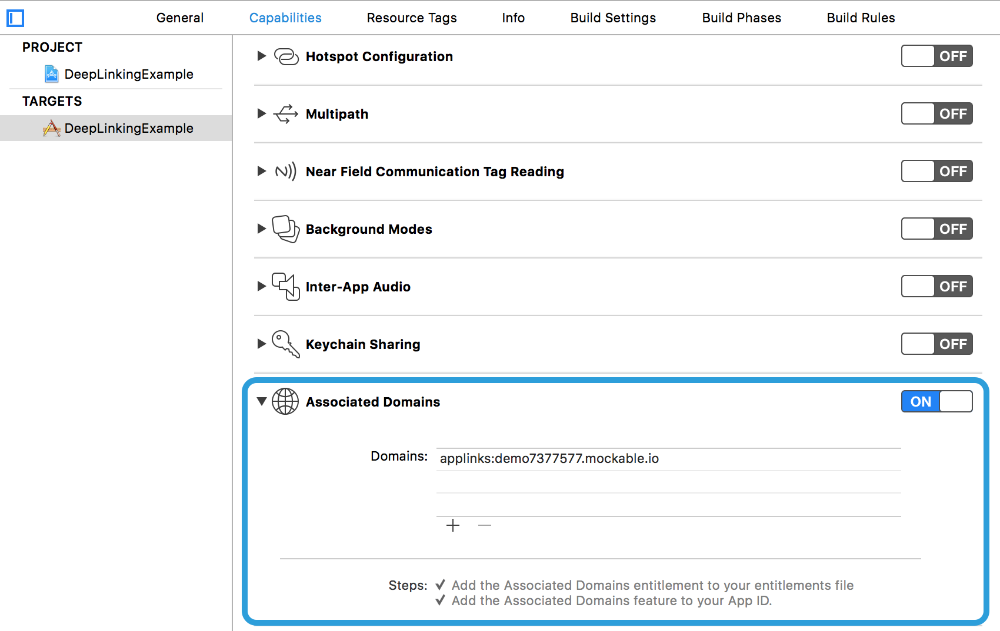

# DeepLinkingExample

This example project is an upgrade to [PassingDataExample](../PassingDataExample) project, and demonstrates the usage of [`CoreNavigation`]'s view controller data passing & routing capabilities.

Medium posts:

- [#2 - Passing data between view controllers.](https://medium.com/@aronbalog/2-ios-reinventing-view-controller-navigation-6d3499d4df73)
- [#3 - Handle Universal Links Like a Boss.](https://medium.com/@aronbalog/3-ios-reinventing-view-controller-navigation-c5bf972bf4b4)

## Installation

Clone [`CoreNavigation`] repo and:

```bash
$ cd Examples/DeepLinkingExample
$ pod install
```

## Use case

>
- App has one view controller `ColorViewController` which:
    - can receive `UIColor`
    - has color picker which triggers navigation to the same view controller type and passes chosen color as data to the new instance
- App can open a deep link `URL` which contains hex string in its path
- App should map hex string to `UIColor` and pass it to `ColorViewController`.
- App should open `ColorViewController` with appropriate color displayed in background using following formats:
    - `https://DOMAIN/color/COLOR_HEX_STRING`
    - `http://DOMAIN/colour/COLOR_HEX_STRING`
    - `https://DOMAIN/color/COLOR_HEX_STRING`
    - `http://DOMAIN/colour/COLOR_HEX_STRING`

## Configuration

*You'll need an active Apple Developer Program subscription to test deep linking capabilities in this demo.*

### 1. Create mockable account

[mockable] is a simple configurable service to mock out RESTful API or SOAP web-services.

### 2. Create `apple-app-site-association` on [mockable]

```json
{
    "applinks": {
        "apps": [],
        "details": [
            {
                "appID": "YOUR_TEAM_ID.org.corenavigation.DeepLinkingExample",
                "paths": ["*"]
            }
        ]
    }
}
```

### 3. Configure target capabilities:

Add [mockable] domain to target's `Associated Domains` capabilities section in the following format:

`applinks:MOCKABLE_DOMAIN`



*Note: Domain defined in screenshot won't work because it won't return correct `apple-app-site-association` file that matches your team id. You have to configure your own domain and ensure `apple-app-site-association` file is available on network.*

## Demo

<p align="center">
  
</p>

[`CoreNavigation`]: https://github.com/aronbalog/CoreNavigation

## Code

### View controller

```swift
import UIKit
import CoreNavigation
import ChromaColorPicker

class ColorViewController: UIViewController {
    ...
}


// MARK: DataReceivable
extension ColorViewController: DataReceivable {
    typealias DataType = UIColor

    func didReceiveData(_ data: UIColor) {
        view.backgroundColor = data
    }
}

// MARK: ChromaColorPickerDelegate
extension ColorViewController: ChromaColorPickerDelegate {
    func colorPickerDidChooseColor(_ colorPicker: ChromaColorPicker, color: UIColor) {
        let alertController = UIAlertController(title: nil, message: "Open as:", preferredStyle: UIAlertControllerStyle.actionSheet)
        
        let viewControllerAction = UIAlertAction(title: "View controller", style: .default, handler: { (_) in
            Navigate.push { $0
                .to(Color())
                .passData(color)
            }
        })
        let urlAction = UIAlertAction(title: "URL", style: .default, handler: { (_) in
            let urlString = "https://demo7377577.mockable.io/color/" + color.hexCode
            
            let url = URL(string: urlString)!
            
            UIApplication.shared.open(url, options: [:], completionHandler: nil)
        })
        let closeAction = UIAlertAction(title: "Close", style: .cancel, handler: nil)
        
        alertController.addAction(viewControllerAction)
        alertController.addAction(urlAction)
        alertController.addAction(closeAction)
        
        present(alertController, animated: true, completion: nil)
    }
}
```

### Destination

```swift
import Foundation
import CoreNavigation

struct Color: Destination {
    typealias ViewControllerType = ColorViewController
    
    static func resolve(context: Context<ViewControllerType>) {
        guard let rgbHexString = context.parameters?["color"] as? String else {
            context.complete()
            return
        }
        
        let color = UIColor(hexString: rgbHexString)
        
        context.complete(data: color)
    }
}
```

### AppDelegate

```swift
import UIKit
import CoreNavigation

@UIApplicationMain
class AppDelegate: UIResponder, UIApplicationDelegate {

    var window: UIWindow? = UIWindow()

    func application(_ application: UIApplication, willFinishLaunchingWithOptions launchOptions: [UIApplicationLaunchOptionsKey : Any]? = nil) -> Bool {
        registerRoutes()
        
        let rootViewController = try! Color().viewController()
        
        window?.rootViewController = UINavigationController(rootViewController: rootViewController)
        window?.makeKeyAndVisible()
        
        return true
    }
    
    func application(_ application: UIApplication, continue userActivity: NSUserActivity, restorationHandler: @escaping ([Any]?) -> Void) -> Bool {
        do {
            try userActivity.navigate()
        } catch {
            return false
        }
        
        return true
    }
    
    func registerRoutes() {
        Color.self <- [
            "https://demo7377577.mockable.io/color/:color([A-Fa-f0-9]{6}|[A-Fa-f0-9]{3})",
            "https://demo7377577.mockable.io/colour/:color([A-Fa-f0-9]{6}|[A-Fa-f0-9]{3})",
            "http://demo7377577.mockable.io/color/:color([A-Fa-f0-9]{6}|[A-Fa-f0-9]{3})",
            "http://demo7377577.mockable.io/colour/:color([A-Fa-f0-9]{6}|[A-Fa-f0-9]{3})"
        ]
    }
}

```

### NSUserActivity extension

```swift
import Foundation
import CoreNavigation

extension NSUserActivity {
    enum Error: Swift.Error {
        case unprocessableEntity
    }
    
    func navigate() throws {
        guard
            activityType == NSUserActivityTypeBrowsingWeb,
            let url = webpageURL
            else {
                throw Error.unprocessableEntity
            }
    
        Navigate.push { $0
            .to(url)
            .animated(false)
            .onSuccess({ (result) in
                let color = result.data as? UIColor
                print("Did open deep link url: \(url), data: \(color!)")
            })
        }
    }
    
}
```

[mockable]: https://www.mockable.io