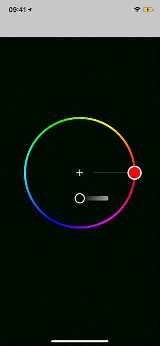

# PassingDataExample

This is an example project which demonstrates the usage of [`CoreNavigation`]'s view controller data passing capabilities.

## Installation

Clone [`CoreNavigation`] repo and:

```bash
$ cd Examples/PassingDataExample
$ pod install
```

## Use case

>
- App has one view controller `ColorViewController` which:
    - can receive `UIColor` as a data
    - has color picker which triggers navigation to same view controller type and passes chosen color as data to the new instance

## Demo

<p align="center">
  
</p>

[`CoreNavigation`]: https://github.com/aronbalog/CoreNavigation

## Code

View controller:

```swift
import UIKit
import CoreNavigation
import ChromaColorPicker

class ColorViewController: UIViewController {
    ...
}


// MARK: DataReceivable
extension ColorViewController: DataReceivable {
    typealias DataType = UIColor

    func didReceiveData(_ data: UIColor) {
        view.backgroundColor = data
    }
}

// MARK: ChromaColorPickerDelegate
extension ColorViewController: ChromaColorPickerDelegate {
    func colorPickerDidChooseColor(_ colorPicker: ChromaColorPicker, color: UIColor) {
        Navigate.push { $0
            .to(Color())
            .passData(color)
        }
    }
}
```

Destination:

```swift
import Foundation
import CoreNavigation

struct Color: Destination {
    typealias ViewControllerType = ColorViewController
}
```